# Nano-vLLM Qwen3.5/Qwen3.6

**English** | [中文](README_zh.md)

<p align="center"></p>

<p align="center"> LLMEngine -> Scheduler -> ModelRunner -> Qwen3.5 model. The 32-layer decoder interleaves 3 GatedDeltaNet layers with 1 full-attention layer." width="100%"></p>

A compact, readable inference engine based on `nano-vllm`, extended for Qwen3.5 hybrid
models and Qwen3.6 FP8 text-only inference experiments.

This repository is intended for learning how LLM inference engines work: tensor
parallelism, KV cache allocation, CUDA Graph decode, hybrid linear-attention state,
and quantized checkpoint loading are all implemented in a small codebase.

## Single RTX 3090: Results and Profile

Qwen3.5-9B BF16 on one RTX 3090 (24 GB, 936 GB/s), PyTorch 2.9.1 + CUDA 12.8,
flash-attn 2.8.3, batch 1, greedy decoding:

| Metric | Measured |
|---|---|
| Decode, CUDA Graph | 24.2 ms/token, **41.4 tok/s** |
| Decode, `--eager` | ~17 tok/s |
| Decode, 4 concurrent requests | 29.0 ms/step, **138 tok/s** aggregate |
| Prefill, 16 / 128 / 512 / 2048 tokens | 238 / 254 / 378 / 899 ms |
| Peak GPU memory (`gpu_memory_utilization=0.9`) | 21.5 GB |

<p align="center"></p>

What the profile says:

- **Decode is memory-bandwidth bound.** Every token reads 15.87 GB of weights
  (MLP 9.66 GB, GatedDeltaNet 3.24 GB, lm_head 2.03 GB, full attention 0.94 GB).
  At 936 GB/s that is a 17.0 ms floor (58 tok/s). The GEMM/GEMV kernels already run at
  about 780 GB/s, 83% of peak.
- **About 21% of a decode step is small kernels.** A step launches 2,263 kernels.
  Most of the non-GEMM time comes from the GatedDeltaNet decode path: the 2 MB fp32
  recurrent state of each layer is gathered with fancy indexing, updated by several
  separate elementwise/reduction passes, and scattered back. The four input
  projections (`in_proj_qkv/z/b/a`) also run as separate GEMVs.
- **Short-prompt prefill is CPU-bound.** `chunk_gated_delta_rule` runs a 63-step Python
  loop per 64-token chunk in each of the 24 GDN layers, and the prefill path calls
  `.item()` on `cu_seqlens`. A 512-token prefill issues about 14.5k kernel launches,
  and the CPU time (409 ms) is roughly twice the GPU time (212 ms).
- **Batching is cheap.** Four concurrent requests cost only 20% more per step than one.

## Optimization Roadmap

<p align="center"></p>

None of these are implemented yet. The numbers are estimates derived from the
profile above, not measurements.

1. **Triton chunk kernel for GDN prefill.** Replace the Python loop in
   `chunk_gated_delta_rule` with a chunked Triton kernel (as in
   flash-linear-attention) and remove the `.item()` syncs. Expected: short-prompt TTFT
   from 238 ms to roughly 30-50 ms.
2. **Fuse the GDN decode path.** A single kernel that updates the recurrent state in
   place via `state_indices`, plus merged input projections, should remove most of the
   ~5 ms of small kernels: ~41 to ~48-50 tok/s.
3. **INT8 weight-only (W8A16).** Decode speed tracks weight bytes, so halving them gives
   ~80 tok/s.
4. **INT4 weight-only (AWQ/GPTQ with Marlin-style kernels, which support sm_86).**
   ~4.5 GB per token gives ~110-125 tok/s. It would also let Qwen3.6-27B (~15 GB in
   INT4) run on one 24 GB card. The current FP8 path dequantizes to BF16 and needs 4 GPUs.

Smaller items: `enable_vision` defaults to `True`, so text-only runs also load the
0.91 GB vision encoder. The default `max_num_seqs=512` captures 36 CUDA graphs at
startup, which single-request tests do not need.

## What Works

- Qwen3 dense text models through the original Nano-vLLM path.
- Qwen3.5-9B BF16 text inference.
- Qwen3.5-9B multimodal smoke test through the local vision encoder path.
- Qwen3.6-27B-FP8 text-only inference on 4 x RTX 4090.
- Tensor parallelism for attention, MLP, vocabulary embedding/head, and GatedDeltaNet.
- CUDA Graph decode when `enforce_eager=False`.
- Rank-local FP8 checkpoint loading: each TP rank slices its shard and dequantizes only
  the shard it owns.
- Experimental Qwen3.6 MTP weight loading, single-step forward probe, and MTP-1
  draft/verify prototype.

## Current Limitations

- Qwen3.6-27B-FP8 is loaded as BF16 weights after FP8 block dequantization. Native FP8
  matmul kernels are not implemented here yet.
- Qwen3.6-27B-FP8 currently targets text-only inference. Use `enable_vision=False`.
- Qwen3.6-27B-FP8 was verified with `tensor_parallel_size=4` on 4 x RTX 4090. TP=2
  does not fit in 24GB cards with the current BF16-resident implementation.
- Loading Qwen3.6-27B-FP8 is slow because the original FP8 checkpoint is converted at
  startup. A pre-converted TP-sharded checkpoint would start faster.
- MTP is currently a prototype for weight loading, one-step draft-token probing, and
  MTP-1 accept-rate measurement. It does not provide decode speedup yet.
- This is not a production serving stack. It is a research/learning implementation.

## Repository Layout

```text
nanovllm/
  engine/          scheduler, model runner, block/state managers
  layers/          attention, linear layers, GatedDeltaNet, sampler
  models/          Qwen3 and Qwen3.5 model definitions
  utils/           checkpoint loader, FP8 dequant helpers, context utilities
examples/          original examples
run_text_qwen35_v2.py
run_text_qwen36_fp8.py
test_mtp_forward.py
test_mtp1_verify.py
test_mtp1_spec_decode.py
test_mtp_spec_decode.py
test_state_rollback.py
bench_qwen35_fixed.py
```

## Installation

Use Python 3.10-3.12 with CUDA-capable PyTorch. Real inference requires GPUs plus
`torch`, `triton`, and `flash-attn`.

```bash
python -m venv .venv
source .venv/bin/activate
python -m pip install -U pip
python -m pip install -e .
```

If your environment already has PyTorch, Triton, and FlashAttention installed, the
editable install is enough.

`nanovllm/utils/image_processing.py` imports `PIL` and `torchvision`, which are not yet
listed in `pyproject.toml`. Install them as well (use a `torchvision` build that matches
your `torch`):

```bash
python -m pip install pillow torchvision
```

## Model Download

Keep model weights outside the repository. The examples assume `~/huggingface`.

```bash
hf download Qwen/Qwen3.5-9B \
  --local-dir ~/huggingface/Qwen3.5-9B \
  --max-workers 8

hf download Qwen/Qwen3.6-27B-FP8 \
  --local-dir ~/huggingface/Qwen3.6-27B-FP8 \
  --max-workers 8
```

Do not commit model weights, generated caches, local images, or benchmark logs.

## Quick Start

Qwen3.5-9B text smoke test:

```bash
python run_text_qwen35_v2.py \
  --model ~/huggingface/Qwen3.5-9B \
  --tp 1
```

Qwen3.5-9B with 4-way tensor parallelism:

```bash
CUDA_VISIBLE_DEVICES=0,1,2,3 python run_text_qwen35_v2.py \
  --model ~/huggingface/Qwen3.5-9B \
  --tp 4
```

Qwen3.6-27B-FP8 text-only on 4 x RTX 4090:

```bash
python run_text_qwen36_fp8.py \
  --model ~/huggingface/Qwen3.6-27B-FP8 \
  --devices 0,1,2,3 \
  --tp 4
```

Disable CUDA Graph for debugging:

```bash
python run_text_qwen36_fp8.py --eager
```

Customize the prompt:

```bash
python run_text_qwen36_fp8.py \
  --prompt "你好，请用三句话介绍你自己。然后讲一个简短笑话。"
```

Qwen3.6 MTP single-step forward probe:

```bash
python test_mtp_forward.py \
  --model ~/huggingface/Qwen3.6-27B-FP8 \
  --devices 0,1,2,3 \
  --tp 4 \
  --top-k 5
```

Qwen3.6 MTP-1 draft/verify prototype:

```bash
python test_mtp1_verify.py \
  --model ~/huggingface/Qwen3.6-27B-FP8 \
  --devices 0,1,2,3 \
  --tp 4 \
  --max-tokens 64
```

Qwen3.6 MTP-1 speculative decode prototype with accept/reject state control:

```bash
python test_mtp1_spec_decode.py \
  --model ~/huggingface/Qwen3.6-27B-FP8 \
  --devices 0,1,2,3 \
  --tp 4 \
  --max-tokens 64
```

Use `--force-reject-attempt 1` to force one reject path and verify state rollback.

Qwen3.6 multi-token MTP speculative decode prototype with batch verify, greedy alignment, and overhead stats:

```bash
python test_mtp_spec_decode.py \
  --model ~/huggingface/Qwen3.6-27B-FP8 \
  --devices 0,1,2,3 \
  --tp 4 \
  --draft-len 4 \
  --verify-mode graph \
  --max-tokens 64
```

This prototype groups draft verification into batch-level accept/reject accounting. `--verify-mode graph` captures verify-length buckets 1-4 as CUDA graphs, so each verify call replays the internal sequential decode steps through one graph. This reduces Python/launch overhead, but it is not a fused parallel GDN verify kernel.

`--verify-mode chunk` is an experimental continuation-prefill verifier. It runs a chunk probe first, then restores the decode state and uses the trusted graph/eager verify path to make accept/reject and state-commit decisions so greedy output stays aligned. Chunk verify-length buckets 1-4 are captured as CUDA graphs when CUDA Graph is enabled. The raw chunk logits are still compared against the trusted path and may differ, so this mode is for studying chunk-verify semantics and overhead before a fused GDN chunk kernel.

Fast-path MTP decode benchmark without top-k/logit-diff probes:

```bash
python run_mtp_fast_decode.py \
  --model ~/huggingface/Qwen3.6-27B-FP8 \
  --devices 0,1,2,3 \
  --tp 4 \
  --draft-len 2 \
  --verify-mode graph \
  --max-tokens 128 \
  --compare-greedy
```

Draft length sweep:

```bash
python bench_mtp_draft_sweep.py \
  --model ~/huggingface/Qwen3.6-27B-FP8 \
  --devices 0,1,2,3 \
  --tp 4 \
  --draft-lens 1,2,3,4 \
  --verify-mode graph \
  --max-tokens 128
```

Decode-state rollback smoke test:

```bash
python test_state_rollback.py \
  --model ~/huggingface/Qwen3.6-27B-FP8 \
  --devices 0,1,2,3 \
  --tp 4
```

## API Example

```python
from nanovllm import LLM, SamplingParams

llm = LLM(
    "/path/to/model",
    tensor_parallel_size=1,
    enforce_eager=True,
)
params = SamplingParams(temperature=0.7, max_tokens=128)
outputs = llm.generate(["Hello, Nano-vLLM."], params)
print(outputs[0]["text"])
```

## Benchmarks

Qwen3.5 single-prompt timing helper:

```bash
python bench_qwen35_fixed.py \
  --model ~/huggingface/Qwen3.5-9B \
  --tp 4 \
  --max-tokens 256 \
  --repeats 3
```

Recent local smoke-test results:

```text
RTX 4090 x4: Qwen3.6-27B-FP8, TP=4, CUDA Graph decode: Decode ~= 41 tok/s
RTX 4090 x4: Qwen3.5-9B,      TP=4, CUDA Graph decode: Decode ~= 98 tok/s
RTX 3090 x1: Qwen3.5-9B BF16, TP=1, CUDA Graph decode: Decode ~= 41 tok/s
```

These are simple single-request smoke tests, not full serving benchmarks.

## Development Checks

Syntax check without model weights:

```bash
python -m compileall nanovllm examples run_text_qwen35_v2.py run_text_qwen36_fp8.py test_mtp_forward.py test_mtp1_verify.py test_mtp1_spec_decode.py test_mtp_spec_decode.py test_state_rollback.py
```

Useful runtime checks:

```bash
nvidia-smi
python -c "import torch; print(torch.__version__, torch.cuda.is_available(), torch.cuda.device_count())"
```

## Open Source Notes

- The project is licensed under MIT. Keep the existing `LICENSE` file.
- `pyproject.toml` points at this fork and keeps a link to the original upstream
  project.
- Keep large artifacts outside git. `.gitignore` excludes common model/checkpoint files.
- Hardware assumptions should be included in issues/PRs when reporting inference results.

## Acknowledgements

This work builds on the original Nano-vLLM project by Xingkai Yu and keeps the MIT
license. The Qwen model weights are distributed separately by Qwen under their own
model terms.
