# Nano-vLLM Qwen3.5/Qwen3.6

[English](README.md) | **中文**

<p align="center"></p>

<p align="center"></p>

基于 `nano-vllm` 的精简、可读推理引擎，扩展支持 Qwen3.5 混合架构模型，以及 Qwen3.6 FP8
纯文本推理实验。

这个仓库用来学习 LLM 推理引擎的工作原理：张量并行、KV 缓存分配、CUDA Graph 解码、
混合线性注意力状态、量化权重加载，都在一个很小的代码库里实现。

## 单张 RTX 3090：实测结果与性能剖析

Qwen3.5-9B BF16，单张 RTX 3090（24 GB，936 GB/s），PyTorch 2.9.1 + CUDA 12.8，
flash-attn 2.8.3，batch 1，贪心解码：

| 指标 | 实测 |
|---|---|
| 解码，CUDA Graph | 24.2 ms/token，**41.4 tok/s** |
| 解码，`--eager` | 约 17 tok/s |
| 解码，4 条请求并发 | 29.0 ms/步，合计 **138 tok/s** |
| Prefill，16 / 128 / 512 / 2048 token | 238 / 254 / 378 / 899 ms |
| 显存峰值（`gpu_memory_utilization=0.9`） | 21.5 GB |

<p align="center"></p>

从剖析结果可以看出：

- **解码受显存带宽限制。** 每生成一个 token 要读 15.87 GB 权重（MLP 9.66 GB、
  GatedDeltaNet 3.24 GB、lm_head 2.03 GB、全注意力 0.94 GB）。按 936 GB/s 计算，
  下限是 17.0 ms（58 tok/s）。GEMM/GEMV kernel 已经跑到约 780 GB/s，即峰值的 83%。
- **每步解码约 21% 的时间花在小 kernel 上。** 每步发射 2263 个 kernel。非 GEMM 时间
  主要来自 GatedDeltaNet 的解码路径：每层 2 MB 的 fp32 递推状态先用花式索引拷出来，
  经过好几次独立的逐元素/归约运算，再拷回去。四个输入投影（`in_proj_qkv/z/b/a`）
  也是分别做的 GEMV。
- **短 prompt 的 prefill 卡在 CPU 上。** `chunk_gated_delta_rule` 在 24 个 GDN 层里，
  对每个 64 token 的块都要跑 63 步 Python 循环；prefill 路径还会对 `cu_seqlens`
  调用 `.item()`。512 token 的 prefill 约发射 1.45 万次 kernel，CPU 耗时（409 ms）
  大约是 GPU 耗时（212 ms）的两倍。
- **组 batch 很便宜。** 4 条请求并发时，每步只比单条慢 20%。

## 优化路线

<p align="center"></p>

以下各项都**还没有实现**。数字是根据上面的剖析估算的，不是实测。

1. **GDN prefill 换成 Triton chunk kernel。** 用分块 Triton kernel（参考
   flash-linear-attention）替换 `chunk_gated_delta_rule` 里的 Python 循环，并去掉
   `.item()` 同步。预计短 prompt 的首 token 延迟从 238 ms 降到约 30–50 ms。
2. **融合 GDN 解码路径。** 写一个 kernel，按 `state_indices` 原地更新递推状态，
   再把输入投影合并成一个矩阵乘，应该能去掉约 5 ms 小 kernel 中的大部分：
   约 41 → 48–50 tok/s。
3. **INT8 仅权重量化（W8A16）。** 解码速度跟着权重字节数走，字节数减半，
   速度约 80 tok/s。
4. **INT4 仅权重量化（AWQ/GPTQ + Marlin 类 kernel，支持 sm_86）。** 每 token 约读
   4.5 GB，约 110–125 tok/s。这样 Qwen3.6-27B（INT4 约 15 GB）也能放进单张 24 GB 显卡；
   现在的 FP8 路径会反量化成 BF16，需要 4 张卡。

小问题：`enable_vision` 默认为 `True`，纯文本推理也会加载 0.91 GB 的视觉编码器；
`max_num_seqs` 默认 512，启动时会录制 36 张 CUDA Graph，单请求测试用不上。

## 已支持

- 通过原版 Nano-vLLM 路径运行 Qwen3 稠密文本模型。
- Qwen3.5-9B BF16 文本推理。
- 通过本地视觉编码器路径做 Qwen3.5-9B 多模态冒烟测试。
- 在 4 × RTX 4090 上运行 Qwen3.6-27B-FP8 纯文本推理。
- 注意力、MLP、词表 embedding/head、GatedDeltaNet 的张量并行。
- `enforce_eager=False` 时使用 CUDA Graph 解码。
- 按 rank 加载 FP8 权重：每个 TP rank 只切出并反量化自己负责的那一片。
- 实验性的 Qwen3.6 MTP：权重加载、单步前向探测、MTP-1 草稿/验证原型。

## 当前限制

- Qwen3.6-27B-FP8 在 FP8 分块反量化后以 BF16 权重形式加载，还没有实现原生 FP8 矩阵乘 kernel。
- Qwen3.6-27B-FP8 目前只做纯文本推理，请设置 `enable_vision=False`。
- Qwen3.6-27B-FP8 在 4 × RTX 4090 上以 `tensor_parallel_size=4` 验证过。按当前
  BF16 常驻的实现，TP=2 在 24GB 显卡上放不下。
- 加载 Qwen3.6-27B-FP8 比较慢，因为启动时要转换原始 FP8 权重。预先转换好、按 TP 切分的权重会启动得更快。
- MTP 目前只是原型，用于权重加载、单步草稿 token 探测和 MTP-1 接受率测量，还不能带来解码加速。
- 这不是生产级服务框架，而是用于研究和学习的实现。

## 目录结构

```text
nanovllm/
  engine/          调度器、model runner、块/状态管理
  layers/          注意力、线性层、GatedDeltaNet、采样器
  models/          Qwen3 与 Qwen3.5 模型定义
  utils/           权重加载、FP8 反量化工具、上下文工具
examples/          原版示例
run_text_qwen35_v2.py
run_text_qwen36_fp8.py
test_mtp_forward.py
test_mtp1_verify.py
test_mtp1_spec_decode.py
test_mtp_spec_decode.py
test_state_rollback.py
bench_qwen35_fixed.py
```

## 安装

使用 Python 3.10–3.12 和支持 CUDA 的 PyTorch。实际推理需要 GPU，以及 `torch`、
`triton` 和 `flash-attn`。

```bash
python -m venv .venv
source .venv/bin/activate
python -m pip install -U pip
python -m pip install -e .
```

如果环境里已经装好了 PyTorch、Triton 和 FlashAttention，执行 editable 安装就够了。

`nanovllm/utils/image_processing.py` 会导入 `pillow` 和 `torchvision`，所以它们是必需依赖。
请先装一个和你的 `torch` 匹配的 `torchvision`，否则 pip 在解析 `torchvision` 时可能会把你的
CUDA 版 `torch` 换掉。例如 `torch 2.9.1+cu128` 对应：

```bash
python -m pip install torchvision==0.24.1 --index-url https://download.pytorch.org/whl/cu128
```

## 下载模型

模型权重放在仓库外面。示例默认放在 `~/huggingface`。

```bash
hf download Qwen/Qwen3.5-9B \
  --local-dir ~/huggingface/Qwen3.5-9B \
  --max-workers 8

hf download Qwen/Qwen3.6-27B-FP8 \
  --local-dir ~/huggingface/Qwen3.6-27B-FP8 \
  --max-workers 8
```

不要提交模型权重、生成的缓存、本地图片或 benchmark 日志。

## 快速开始

Qwen3.5-9B 文本冒烟测试：

```bash
python run_text_qwen35_v2.py \
  --model ~/huggingface/Qwen3.5-9B \
  --tp 1
```

Qwen3.5-9B 4 路张量并行：

```bash
CUDA_VISIBLE_DEVICES=0,1,2,3 python run_text_qwen35_v2.py \
  --model ~/huggingface/Qwen3.5-9B \
  --tp 4
```

在 4 × RTX 4090 上运行 Qwen3.6-27B-FP8 纯文本推理：

```bash
python run_text_qwen36_fp8.py \
  --model ~/huggingface/Qwen3.6-27B-FP8 \
  --devices 0,1,2,3 \
  --tp 4
```

关闭 CUDA Graph 以便调试：

```bash
python run_text_qwen36_fp8.py --eager
```

自定义 prompt：

```bash
python run_text_qwen36_fp8.py \
  --prompt "你好，请用三句话介绍你自己。然后讲一个简短笑话。"
```

Qwen3.6 MTP 单步前向探测：

```bash
python test_mtp_forward.py \
  --model ~/huggingface/Qwen3.6-27B-FP8 \
  --devices 0,1,2,3 \
  --tp 4 \
  --top-k 5
```

Qwen3.6 MTP-1 草稿/验证原型：

```bash
python test_mtp1_verify.py \
  --model ~/huggingface/Qwen3.6-27B-FP8 \
  --devices 0,1,2,3 \
  --tp 4 \
  --max-tokens 64
```

带接受/拒绝状态控制的 Qwen3.6 MTP-1 投机解码原型：

```bash
python test_mtp1_spec_decode.py \
  --model ~/huggingface/Qwen3.6-27B-FP8 \
  --devices 0,1,2,3 \
  --tp 4 \
  --max-tokens 64
```

用 `--force-reject-attempt 1` 强制走一次拒绝路径，验证状态回滚。

带批量验证、贪心对齐和开销统计的 Qwen3.6 多 token MTP 投机解码原型：

```bash
python test_mtp_spec_decode.py \
  --model ~/huggingface/Qwen3.6-27B-FP8 \
  --devices 0,1,2,3 \
  --tp 4 \
  --draft-len 4 \
  --verify-mode graph \
  --max-tokens 64
```

这个原型把草稿验证按 batch 统计接受/拒绝。`--verify-mode graph` 会把验证长度 1–4 分别录制成 CUDA Graph，每次验证通过一张图重放内部的逐步解码。这样减少了 Python 和 kernel 启动开销，但它并不是融合的并行 GDN 验证 kernel。

`--verify-mode chunk` 是实验性的续写式 prefill 验证器。它先跑一次分块探测，然后恢复解码状态，再用可信的 graph/eager 验证路径做接受/拒绝和状态提交，保证贪心输出对齐。启用 CUDA Graph 时，分块验证长度 1–4 也会录制成 CUDA Graph。原始分块 logits 仍会和可信路径对比，可能存在差异，所以这个模式用于在写融合 GDN 分块 kernel 之前研究分块验证的语义和开销。

不带 top-k/logit 差异探测的快速 MTP 解码 benchmark：

```bash
python run_mtp_fast_decode.py \
  --model ~/huggingface/Qwen3.6-27B-FP8 \
  --devices 0,1,2,3 \
  --tp 4 \
  --draft-len 2 \
  --verify-mode graph \
  --max-tokens 128 \
  --compare-greedy
```

草稿长度扫描：

```bash
python bench_mtp_draft_sweep.py \
  --model ~/huggingface/Qwen3.6-27B-FP8 \
  --devices 0,1,2,3 \
  --tp 4 \
  --draft-lens 1,2,3,4 \
  --verify-mode graph \
  --max-tokens 128
```

解码状态回滚冒烟测试：

```bash
python test_state_rollback.py \
  --model ~/huggingface/Qwen3.6-27B-FP8 \
  --devices 0,1,2,3 \
  --tp 4
```

## API 示例

```python
from nanovllm import LLM, SamplingParams

llm = LLM(
    "/path/to/model",
    tensor_parallel_size=1,
    enforce_eager=True,
)
params = SamplingParams(temperature=0.7, max_tokens=128)
outputs = llm.generate(["Hello, Nano-vLLM."], params)
print(outputs[0]["text"])
```

## Benchmark

Qwen3.5 单 prompt 计时工具：

```bash
python bench_qwen35_fixed.py \
  --model ~/huggingface/Qwen3.5-9B \
  --tp 4 \
  --max-tokens 256 \
  --repeats 3
```

最近的本地冒烟测试结果：

```text
RTX 4090 x4: Qwen3.6-27B-FP8, TP=4, CUDA Graph decode: Decode ~= 41 tok/s
RTX 4090 x4: Qwen3.5-9B,      TP=4, CUDA Graph decode: Decode ~= 98 tok/s
RTX 3090 x1: Qwen3.5-9B BF16, TP=1, CUDA Graph decode: Decode ~= 41 tok/s
```

这些是简单的单请求冒烟测试，不是完整的服务端 benchmark。

## 开发检查

不需要模型权重的语法检查：

```bash
python -m compileall nanovllm examples run_text_qwen35_v2.py run_text_qwen36_fp8.py test_mtp_forward.py test_mtp1_verify.py test_mtp1_spec_decode.py test_mtp_spec_decode.py test_state_rollback.py
```

常用运行时检查：

```bash
nvidia-smi
python -c "import torch; print(torch.__version__, torch.cuda.is_available(), torch.cuda.device_count())"
```

## 开源说明

- 项目使用 MIT 许可证，请保留现有的 `LICENSE` 文件。
- `pyproject.toml` 指向本 fork，并保留了原始上游项目的链接。
- 大文件不要放进 git。`.gitignore` 已经排除了常见的模型/权重文件。
- 在 issue/PR 中报告推理结果时，请注明硬件环境。

## 致谢

本项目基于 Xingkai Yu 的原版 Nano-vLLM，沿用 MIT 许可证。Qwen 模型权重由 Qwen
另行发布，适用其自己的模型条款。
